# Netflix Clone | End-to-End DevSecOps CI/CD Pipeline with Security Scanning and Kubernetes on AWS


A **complete end-to-end DevSecOps project** showcasing how to automate, secure, and monitor infrastructure and applications using modern tools — from **Terraform to Kubernetes**, **Jenkins to Trivy**, and everything in between.

Built to demonstrate **real-world DevSecOps workflows** for CI/CD, cloud automation, security integration, and observability — all in one Netflix-themed application. 🍿

---

## 📋 Table of Contents

- [🚀 Project Overview](#-project-overview)
- [🌐 Key Features](#-key-features)
- [🧩 Directory Structure](#-directory-structure)
- [🛠️ Tech Stack](#️-tech-stack)
- [🚀 Infrastructure Automation with Terraform Cloud & GitHub Actions](#-infrastructure-automation-with-terraform-cloud--github-actions)
  - [🔐 Terraform Cloud Authentication](#-terraform-cloud-authentication)
  - [⚙️ Automating Infrastructure with GitHub Actions](#️-automating-infrastructure-with-github-actions)
  - [🚀 Infrastructure Deployment Flow](#-infrastructure-deployment-flow)
- [🛠️ Toolchain Overview](#️-toolchain-overview)
- [⚙️ Jenkins Server Setup](#️-jenkins-server-setup)
- [🐳 Docker Installation on Jenkins](#-docker-installation-on-jenkins)
- [🧠 SonarQube Setup (Code Quality)](#-sonarqube-setup-code-quality)
- [🛡️ Trivy Installation (Security Scanning)](#️-trivy-installation-security-scanning)
- [⚙️ kubectl Installation](#️-kubectl-installation)
- [🔔 Slack Notifications Setup](#-slack-notifications-setup)
- [🛠️ Jenkins Plugin Installation](#️-jenkins-plugin-installation)
- [⚙️ Plugin Configuration](#️-plugin-configuration)
  - [🟢 NodeJS Configuration](#-nodejs-configuration)
  - [🧠 SonarQube Integration](#-sonarqube-integration)
  - [🚦 Quality Gate Webhook Setup](#-quality-gate-webhook-setup)
  - [📊 SonarQube Project Setup](#-sonarqube-project-setup)
- [🧩 Jenkins Pipeline Creation](#-jenkins-pipeline-creation)
- [🛡️ OWASP Dependency Check Integration](#️-owasp-dependency-check-integration)
- [🐳 Docker Integration for Image Build & Push](#-docker-integration-for-image-build--push)
- [🔔 Pipeline Visibility](#-pipeline-visibility)
- [🎬 TMDB API Key Setup](#-tmdb-api-key-setup)
- [🐳 Docker Configuration & Pipeline Execution](#-docker-configuration--pipeline-execution)
- [🏗️ Kubernetes Cluster Setup Using kubeadm](#️-kubernetes-cluster-setup-using-kubeadm)
- [🔗 Integrating Kubernetes with Jenkins](#-integrating-kubernetes-with-jenkins)
- [🚀 Re-running the Jenkins Pipeline](#-re-running-the-jenkins-pipeline)
- [🌐 Application Access](#-application-access)
- [🏗️ Monitoring Architecture](#️-monitoring-architecture)
  - [⚙️ Prometheus Setup](#️-prometheus-setup-monitoring-server)
  - [🧩 Node Exporter Setup](#-node-exporter-setup-all-servers)
  - [🔄 Prometheus Scrape Configuration](#-prometheus-scrape-configuration)
  - [📈 Grafana Setup](#-grafana-setup-visualization-layer)
  - [🔔 Jenkins Monitoring](#-jenkins-monitoring)
  - [☸️ Kubernetes Monitoring](#️-kubernetes-monitoring)
- [✅ Final Result](#-final-result)

---

## 🚀 Project Overview

This project simulates a real enterprise-grade setup where a **React-based Netflix Clone** is deployed and managed through a **secure, automated DevOps pipeline**.

---

## 🌐 Key Features

- **Infrastructure as Code** with Terraform (AWS provisioning)
- **State management** using Terraform Cloud
- **CI/CD automation** with GitHub Actions and Jenkins
- **Security Scanning** with Trivy & OWASP Dependency Check
- **Containerization** with Docker
- **Kubernetes Deployment** (unmanaged cluster setup)
- **Monitoring Stack** for Jenkins, Kubernetes, and the app itself

---

## 🧩 Directory Structure

```bash
.
├── Application-Code        # Frontend Netflix Clone app built with React + Vite
│   ├── Dockerfile           # Docker image build instructions
│   ├── package.json         # Dependencies and scripts
│   ├── src/                 # Main source code
│   └── public/              # Static assets
│
├── Jenkins
│   └── Jenkinsfile          # CI/CD pipeline configuration (build → test → deploy)
│
├── Kubernetes
│   ├── deployment.yml       # App deployment manifest
│   └── service.yml          # K8s service exposure
│
└── Terraform
    ├── main.tf              # AWS resource definitions
    ├── backend.tf           # Terraform Cloud backend configuration
    ├── iam.tf               # IAM roles and policies
    ├── vpc.tf               # Network setup
    ├── variables.tf         # Input variables
    ├── dev.auto.tfvars      # Environment variables
    └── gather.tf            # Data sources and dependencies
```

---

## 🛠️ Tech Stack

| Category | Tools / Technologies |
|-----------|----------------------|
| **Infrastructure** | Terraform, AWS EC2, Terraform Cloud |
| **CI/CD** | Jenkins, GitHub Actions |
| **Security** | Trivy, SonarQube, OWASP Dependency Check |
| **Containerization** | Docker |
| **Orchestration** | Kubernetes (Unmanaged Cluster) |
| **Monitoring** | Node Exporter, Prometheus, Kube State Metrics |
| **Frontend** | React, Vite, TMDB API |

---

## 🚀 Infrastructure Automation with Terraform Cloud & GitHub Actions

To automate AWS infrastructure provisioning, I integrated Terraform Cloud with GitHub Actions, enabling secure, remote, and fully automated Terraform operations as part of the CI/CD workflow.

### 🔐 Terraform Cloud Authentication

I created an API token in Terraform Cloud and securely stored it as a GitHub Actions secret. This allows GitHub Actions to authenticate with Terraform Cloud while running Terraform commands such as init, plan, and apply, without exposing sensitive credentials in the repository.

### ⚙️ Automating Infrastructure with GitHub Actions

I configured a GitHub Actions workflow to automatically manage the AWS infrastructure using Terraform. The pipeline performs the following actions:

- Initializes Terraform using Terraform Cloud as the remote backend
- Executes terraform plan to validate infrastructure changes
- Applies the configuration using terraform apply after approval
- Provisions AWS resources in a consistent and repeatable manner

This setup ensures that infrastructure changes are version-controlled, auditable, and automated.

### 🚀 Infrastructure Deployment Flow

With Terraform, Terraform Cloud, and GitHub Actions integrated, the infrastructure deployment process is fully automated on AWS.

To deploy the infrastructure:

1. Navigate to the Actions tab in the GitHub repository
2. Select the Terraform workflow
3. Choose Apply from the dropdown
4. Trigger the workflow to provision or update AWS resources

Once triggered, GitHub Actions securely connects to Terraform Cloud and deploys the infrastructure on AWS.

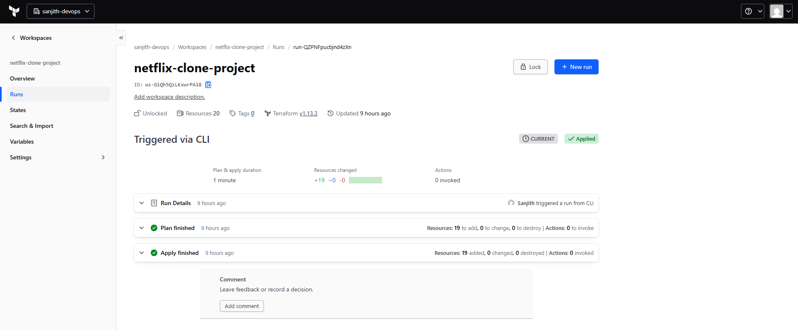

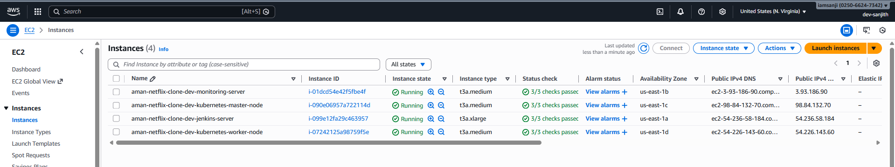

---

## 🛠️ Toolchain Overview

- **Jenkins** — CI/CD orchestrator
- **Docker** — Container runtime for isolated and repeatable builds
- **SonarQube** — Static code analysis and code quality gates
- **Trivy** — Vulnerability scanning for images and dependencies
- **kubectl** — CLI utility for upcoming Kubernetes deployments
- **Slack Notifications** — Pipeline status alerts (success/failure)

---

## ⚙️ Jenkins Server Setup

I started by connecting to the Jenkins EC2 instance using AWS Session Manager and logged in as the ubuntu user.

Before installing Jenkins, I installed Java, which is a prerequisite.

Once Java was installed, I installed Jenkins, started the service, and verified the setup by accessing the Jenkins UI on port 8080 using the public IP of the server.

After retrieving the initial admin password, I:

- Installed the recommended Jenkins plugins
- Created a new Jenkins user instead of using the default admin account
- Completed the setup and validated that Jenkins was running successfully

At this point, the Jenkins server was fully operational.

---

## 🐳 Docker Installation on Jenkins

To enable Jenkins to build and run containers, I installed Docker on the Jenkins server.

I added both the jenkins and ubuntu users to the Docker group and restarted the Docker service. This allows Jenkins pipelines to execute Docker commands without permission issues.

Docker is used to:

- Build application images
- Run SonarQube as a container
- Scan images using Trivy

---

## 🧠 SonarQube Setup (Code Quality)

For static code analysis and quality checks, I deployed SonarQube using a Docker container instead of installing it directly on the EC2 instance.

Running SonarQube in Docker keeps the setup lightweight and easy to manage.

After starting the container, I accessed the SonarQube dashboard on port 9000, logged in using the default credentials, and updated the admin password.

SonarQube is later integrated into the Jenkins pipeline to:

- Analyze code quality
- Detect bugs and code smells
- Enforce quality gates before deployment

---

## 🛡️ Trivy Installation (Security Scanning)

To introduce shift-left security, I installed Trivy on the Jenkins server.

Trivy is used in the pipeline to:

- Scan Docker images for vulnerabilities
- Detect vulnerable dependencies
- Fail builds if critical issues are found

This ensures security checks are part of the CI/CD workflow, not an afterthought.

---

## ⚙️ kubectl Installation

I installed kubectl on the Jenkins server to prepare for Kubernetes deployments.

This allows Jenkins pipelines to:

- Interact with Kubernetes clusters
- Deploy application manifests
- Manage resources programmatically

This step enables seamless CI/CD → Kubernetes integration.

---

## 🔔 Slack Notifications Setup

To receive pipeline status updates, I integrated Jenkins with Slack.

Steps:

1. Install the Slack Notification plugin in Jenkins
2. Create a Slack App and generate a Bot User Token
3. Add the token as a Jenkins credential
4. Configure the workspace and channel in Jenkins
5. Invite the Jenkins bot to the Slack channel
6. Test and save the configuration

Jenkins now sends notifications for pipeline success, failure, and aborted runs.

---

## 🛠️ Jenkins Plugin Installation

To support the pipeline stages, I installed the required Jenkins plugins:

- **SonarQube Scanner** — for integrating SonarQube scans
- **NodeJS** — to build and test the Node.js-based application

After installing the plugins, I restarted Jenkins to apply the changes.

---

## ⚙️ Plugin Configuration

### 🟢 NodeJS Configuration

From Manage Jenkins → Tools, I configured:

- A NodeJS installation with a suitable version for the application
- Enabled automatic installation
- Saved and applied the configuration

This allows Jenkins to build the React/Node-based Netflix Clone during pipeline execution.

### 🧠 SonarQube Integration

To enable static code analysis and quality gates, I integrated SonarQube with Jenkins.

**SonarQube Authentication:**
- Generated a SonarQube token from the SonarQube dashboard
- Stored the token securely as a Jenkins credential

**Jenkins–SonarQube Configuration:**
- Added SonarQube under Manage Jenkins → System
- Configured the server name (sonar-server) and server URL
- Linked the previously added credentials
- Configured SonarQube Scanner under Manage Jenkins → Tools

### 🚦 Quality Gate Webhook Setup

To enable Jenkins to receive SonarQube Quality Gate results, I:

- Created a webhook in SonarQube
- Configured it to point to the Jenkins webhook endpoint

This ensures the pipeline reacts automatically based on code quality results.

### 📊 SonarQube Project Setup

On the SonarQube dashboard, I:

- Created a local project
- Selected JS/TS & Web (Node.js-based application)
- Reused the existing authentication token
- Copied the generated scan commands for Jenkins pipeline usage

---

## 🧩 Jenkins Pipeline Creation

I created a new Jenkins pipeline job and configured it to:

- Pull the pipeline script directly from GitHub
- Execute the pipeline stages defined in the repository

During the initial run, the pipeline failed at the OWASP Dependency Check stage, which was expected because the tool was not yet installed.

This mirrors a real-world DevSecOps scenario where missing security tooling causes pipeline failures.

---

## 🛡️ OWASP Dependency Check Integration

To resolve the failure:

- Installed the OWASP Dependency Check Jenkins plugin
- Configured the tool under Manage Jenkins → Tools
- Enabled automatic installation

After re-running the pipeline:

- Dependency scanning completed successfully
- Vulnerability reports were generated
- Slack notifications confirmed the pipeline status

---

## 🐳 Docker Integration for Image Build & Push

Since the pipeline includes Docker image creation:

- Ensured Docker was properly configured on Jenkins
- Generated a Docker Hub Personal Access Token
- Stored the credentials securely in Jenkins
- Installed the Docker plugin to support image build and push operations

This enables Jenkins to:

- Build Docker images
- Scan them using Trivy
- Push them to Docker Hub securely

---

## 🔔 Pipeline Visibility

Throughout the process:

- Pipeline failures and successes triggered Slack notifications
- SonarQube reports validated code quality
- OWASP reports confirmed dependency health

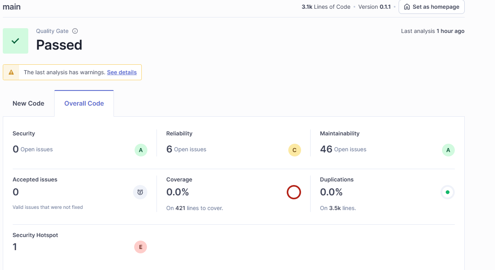

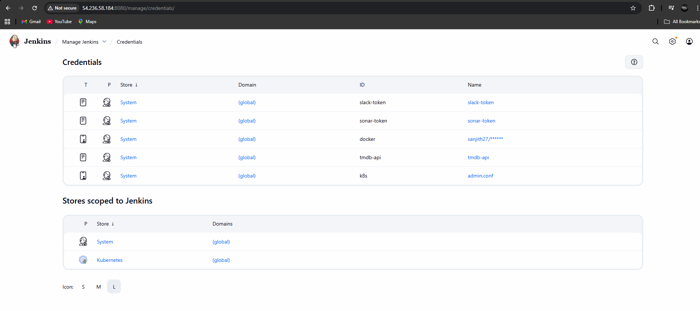

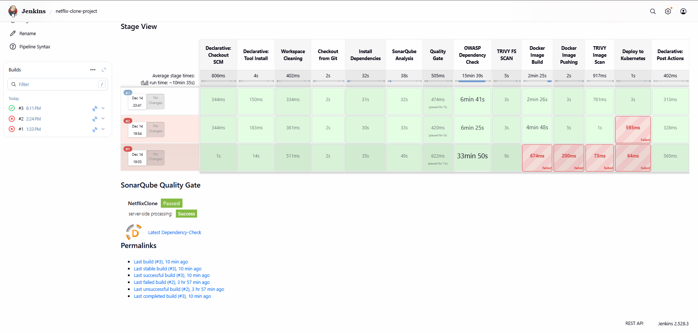

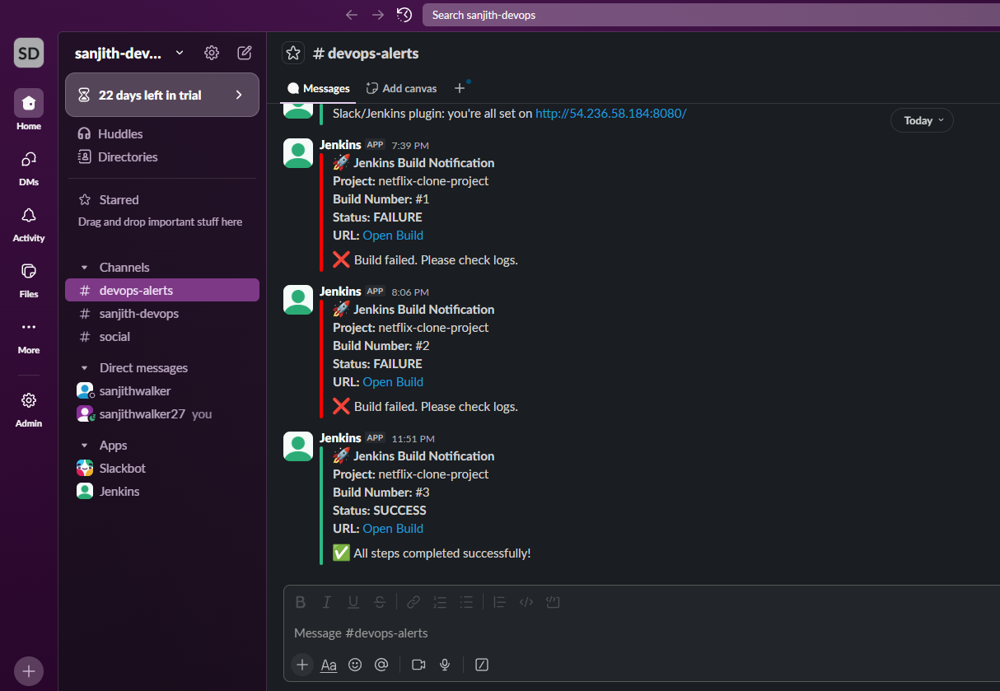

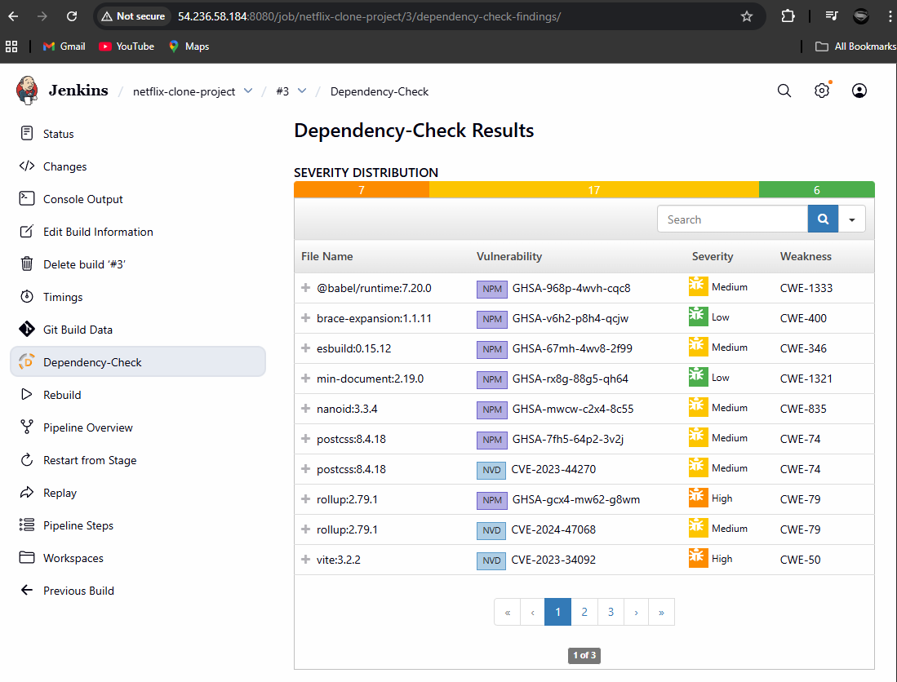

---

## 🎬 TMDB API Key Setup

To enable movie data in the Netflix Clone, I generated an API key from TMDB.

Steps:

1. Create an account at themoviedb.org
2. Go to Profile → Settings → API
3. Generate a new API key
4. Add the API key as a credential in Jenkins

---

## 🐳 Docker Configuration & Pipeline Execution

After adding the TMDB API key:

- Configured the Docker tool in Jenkins
- Ran the Jenkins pipeline again

The pipeline successfully:

- Built the Docker image
- Pushed the image to Docker Hub

---

## 🏗️ Kubernetes Cluster Setup Using kubeadm

### 1️⃣ Hostname Configuration

I first logged into both EC2 instances and set clear hostnames so Kubernetes could identify node roles.

**Master node:**
```bash
sudo hostnamectl set-hostname k8s-master
```

**Worker node:**
```bash
sudo hostnamectl set-hostname k8s-worker
```

### 2️⃣ Kubernetes Version & System Preparation (Both Nodes)

I defined the Kubernetes version and prepared the OS to meet Kubernetes requirements.

Key things I did:

- Disabled swap (mandatory for Kubernetes)
- Loaded required kernel modules
- Enabled IP forwarding and bridge networking

This ensures pods can communicate across nodes.

### 3️⃣ Container Runtime Setup (containerd)

Kubernetes needs a container runtime to run pods. I installed containerd on both nodes and configured it to use systemd cgroups, which Kubernetes expects.

After configuration:

- containerd was running
- enabled on boot
- ready to handle pod workloads

### 4️⃣ Installing Kubernetes Components (Both Nodes)

On both Master and Worker nodes, I installed:

- **kubeadm** → cluster bootstrap tool
- **kubelet** → node agent
- **kubectl** → cluster management CLI

I also locked the versions to avoid accidental upgrades.

### 5️⃣ Initializing the Cluster (Master Node Only)

On the Master node, I initialized the cluster:

```bash
kubeadm init --pod-network-cidr=10.244.0.0/16
```

Why this matters:

- Initializes the control plane
- Generates cluster certificates
- Creates the join command for worker nodes
- Defines the pod network CIDR (required for Flannel)

### 6️⃣ kubectl Configuration (Master Node)

After initialization, I configured kubectl so I could manage the cluster as a normal user:

- Copied admin.conf
- Set correct permissions

This allowed me to run commands like:
```bash
kubectl get nodes
kubectl get pods -A
```

### 7️⃣ Installing Pod Network (Flannel)

Without a network plugin, pods cannot talk to each other.

I installed Flannel:

```bash
kubectl apply -f https://github.com/flannel-io/flannel/releases/latest/download/kube-flannel.yml
```

After this:

- Core system pods moved to Running
- Cluster networking became functional

### 8️⃣ Joining the Worker Node

Using the kubeadm join command generated earlier, I joined the worker node to the cluster.

Once completed:

```bash
kubectl get nodes
```

Both master and worker nodes appeared as Ready.

At this point, the Kubernetes cluster was fully operational.

---

## 🔗 Integrating Kubernetes with Jenkins

**Why This Was Needed:**

Jenkins must authenticate with Kubernetes to deploy workloads.

To achieve this, I:

1. Retrieved the kubeconfig file from the master node:
   ```bash
   sudo cat /etc/kubernetes/admin.conf
   ```

2. Added this kubeconfig securely to Jenkins credentials

3. Configured Jenkins pipelines to use kubectl with this config

This allowed Jenkins to:

- Apply Kubernetes manifests
- Create Deployments and Services
- Verify rollout status

---

## 🚀 Re-running the Jenkins Pipeline

Once Kubernetes integration was complete, I re-ran the Jenkins pipeline.

This time:

- Docker image was built and pushed
- Jenkins successfully connected to Kubernetes
- Deployment manifests were applied
- Pods were created and started successfully

I validated the deployment using:

```bash
kubectl get all -n default
```

---

## 🌐 Application Access

After confirming all pods and services were running:

- The Netflix Clone application became accessible
- The CI/CD pipeline finally completed end-to-end without failure

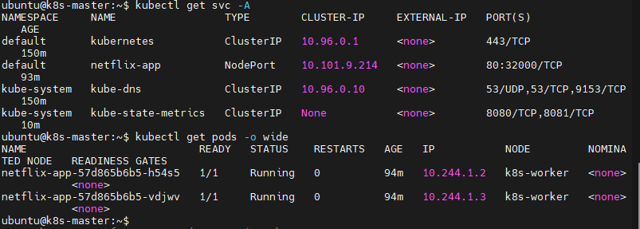

---

## 🏗️ Monitoring Architecture (How I Designed It)

I followed a centralized pull-based monitoring model:

- Prometheus runs on one Monitoring EC2 instance
- Node Exporter runs on every server that needs monitoring
- Prometheus scrapes metrics from all exporters
- Grafana visualizes everything using dashboards

This is a standard production-grade monitoring design.

---

## ⚙️ Prometheus Setup (Monitoring Server)

### 1️⃣ System Preparation

I updated the system and created a dedicated system user for Prometheus to follow security best practices.

Why:

- Prometheus should not run as root
- Limits blast radius if compromised

I also created required directories:

- `/etc/prometheus` → configuration
- `/var/lib/prometheus` → metrics storage

### 2️⃣ Installing Prometheus

I downloaded the official Prometheus binary, extracted it, and:

- Moved the prometheus and promtool binaries to `/usr/local/bin`
- Placed prometheus.yml in `/etc/prometheus`
- Assigned ownership to the prometheus user

This gives full control without relying on package managers.

### 3️⃣ Prometheus as a System Service

I created a systemd service for Prometheus so that:

- It starts automatically on reboot
- Can be managed via systemctl
- Runs reliably in the background

After enabling and starting the service, I validated:

- Prometheus service status
- Prometheus UI on port 9090

At this point, Prometheus was running but not scraping anything yet.

---

## 🧩 Node Exporter Setup (All Servers)

**Why Node Exporter?**

Node Exporter exposes OS-level metrics, such as:

- CPU usage
- Memory utilization
- Disk I/O
- Network traffic

This is essential for infrastructure monitoring.

**Node Exporter Installation Flow:**

I followed the same approach on:

- Monitoring Server
- Jenkins Server
- Kubernetes Master
- Kubernetes Worker

For each server:

1. Created a node_exporter system user
2. Downloaded and extracted Node Exporter
3. Moved the binary to `/usr/local/bin`
4. Created a systemd service
5. Enabled and started the service

Each node now exposed metrics on:

```
http://<node-ip>:9100/metrics
```

I verified metrics using curl before integrating with Prometheus.

---

## 🔄 Prometheus Scrape Configuration

Once exporters were running, I configured Prometheus to scrape them.

In prometheus.yml, I added separate scrape jobs for:

- Prometheus itself
- Node Exporter on Monitoring Server
- Jenkins Server
- Kubernetes Master Node
- Kubernetes Worker Node

After updating the config:

1. Validated it using promtool
2. Restarted Prometheus
3. Confirmed all targets were UP in the Prometheus UI

This confirmed metrics were flowing correctly.

---

## 📈 Grafana Setup (Visualization Layer)

### 1️⃣ Grafana Installation

On the Monitoring Server, I:

- Installed Grafana
- Enabled and started the Grafana service
- Accessed the Grafana UI on port 3000

### 2️⃣ Prometheus as a Data Source

Inside Grafana:

- Added Prometheus as a data source
- Pointed it to the Prometheus server URL
- Verified successful connection

This connects metrics storage → visualization.

### 3️⃣ Importing Dashboards

Instead of building dashboards from scratch, I imported community-proven dashboards.

For Linux server metrics:

- Imported dashboard ID: 14513

This instantly gave me:

- CPU, memory, disk, and network graphs
- Per-node visibility
- Historical performance trends

---

## 🔔 Jenkins Monitoring

To monitor Jenkins:

- Installed the Prometheus metrics plugin in Jenkins
- Exposed Jenkins metrics at `/prometheus`
- Added Jenkins as a scrape target in Prometheus

After importing a Jenkins dashboard in Grafana, I could see:

- JVM memory usage
- Build executor load
- Job execution metrics

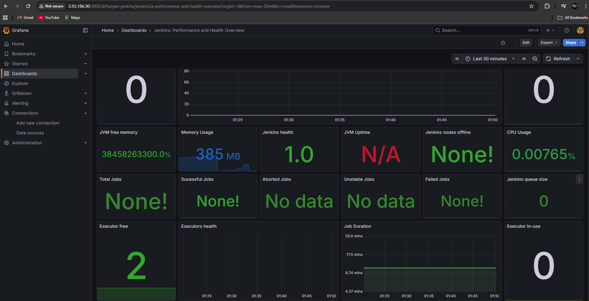

---

## ☸️ Kubernetes Monitoring

**Node-Level Monitoring:**

Since Node Exporter was running on both:

- Kubernetes Master
- Kubernetes Worker

I could monitor:

- Node health
- Resource usage
- System-level bottlenecks

Each node had its own Grafana dashboard.

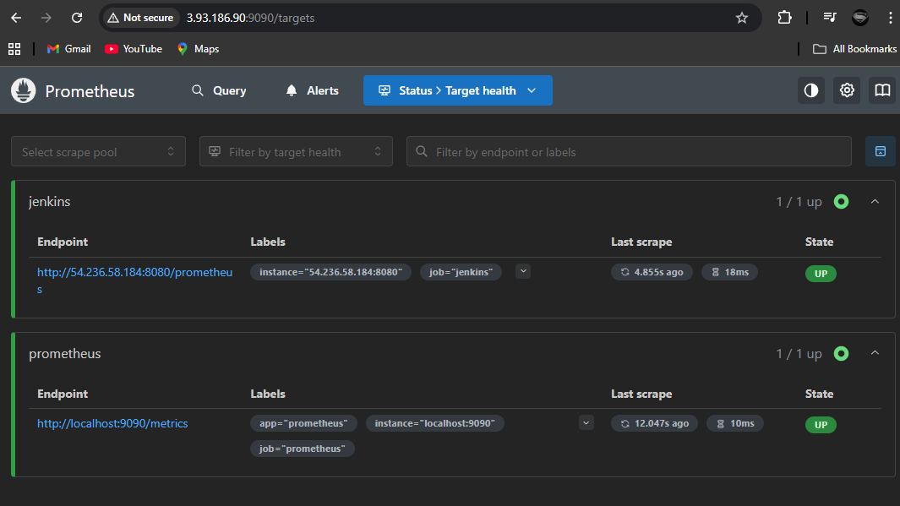

---

## ✅ Final Result

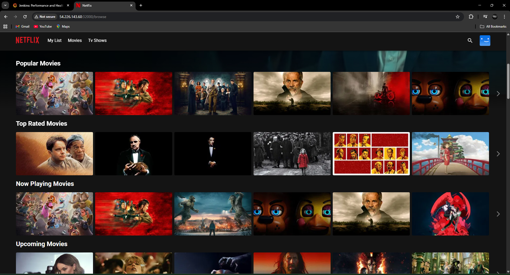
